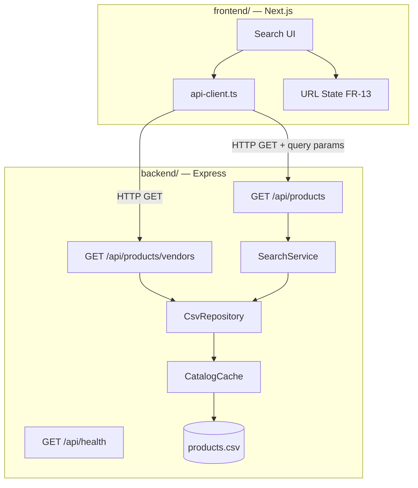
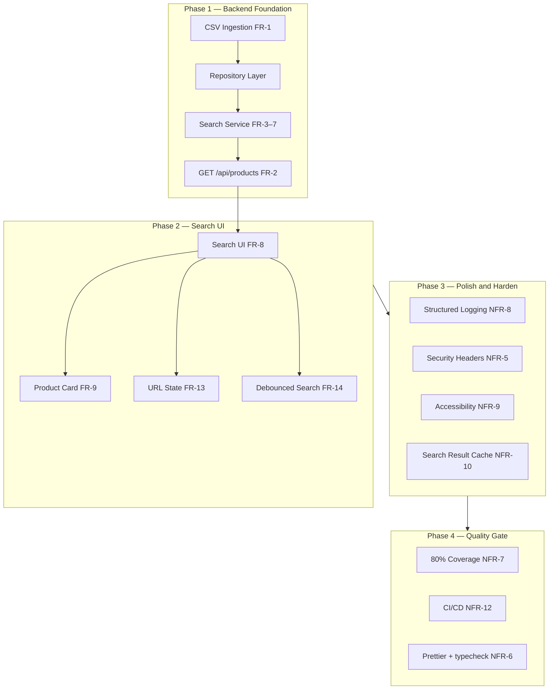

# HEALF Product Search — Full-Stack Implementation Plan

Phased rollout for a **split-stack** take-home: **Express API** in `backend/` and **Next.js 16 App Router UI** in `frontend/`. Search logic lives exclusively on the Express server; the frontend never touches the CSV.

**Assignment time box:** 60–90 minutes of focused work. Depth over breadth — a working API + clean UI beats shallow coverage of every nice-to-have.

**Current state:** Next.js scaffold in `frontend/` only. No `backend/` yet, no CSV committed.

---

## Guiding Principles

| Principle | Rationale |
|-----------|-----------|
| **Split stack from day one** | `backend/` = HTTP API + domain logic. `frontend/` = UI consumer only. Stable contract for mobile or alternate frontends. |
| **Layers inside the backend** | Routes → Search Service → Repository → CSV. Swap data source (Shopify) without breaking consumers. |
| **Server-side only** | CSV parsed and cached in Express. Client talks to API over HTTP — never imports CSV or backend modules. |
| **Boring tech** | Express, Zod, Vitest, in-memory cache. No Redis/OpenSearch until scale demands it. |
| **URL as source of truth** | All search state in query params for deep linking and shareability (FR-13). |
| **Fail soft on data, fail hard on validation** | Bad CSV rows are skipped; bad API params return 400. |

---

## Repository Layout

```
healf-product-search/
├── backend/                          # Express.js API server
│   ├── src/
│   │   ├── index.ts                  # App bootstrap, middleware, listen
│   │   ├── app.ts                    # Express app factory (testable)
│   │   ├── routes/
│   │   │   ├── index.ts              # Mount /api/*
│   │   │   ├── products.ts           # GET /api/products
│   │   │   ├── vendors.ts            # GET /api/products/vendors
│   │   │   └── health.ts             # GET /api/health
│   │   ├── middleware/
│   │   │   ├── validate-query.ts
│   │   │   ├── request-logger.ts
│   │   │   └── error-handler.ts
│   │   ├── services/
│   │   │   └── search-service.ts
│   │   ├── repository/
│   │   │   ├── product-repository.ts # Interface
│   │   │   └── csv-repository.ts     # CSV implementation
│   │   ├── cache/
│   │   │   ├── catalog-cache.ts
│   │   │   └── search-cache.ts       # Phase 3
│   │   ├── schemas/
│   │   │   ├── product.ts
│   │   │   └── search-params.ts
│   │   ├── types/
│   │   │   └── product.ts
│   │   └── logger.ts                 # Phase 3
│   ├── data/
│   │   └── products.csv              # Provided dataset
│   ├── __tests__/                    # Phase 4
│   ├── package.json
│   └── tsconfig.json
├── frontend/                         # Next.js App Router UI
│   ├── app/
│   │   ├── page.tsx                  # Search page
│   │   └── layout.tsx
│   ├── components/
│   │   └── search/
│   │       ├── search-page.tsx       # Orchestrator; reads/writes URL params
│   │       ├── search-bar.tsx        # Text input with debounce
│   │       ├── filter-panel.tsx      # Vendor, price range, availability
│   │       ├── product-grid.tsx      # Responsive grid layout
│   │       ├── product-card.tsx
│   │       ├── pagination.tsx
│   │       ├── loading-skeleton.tsx
│   │       ├── empty-state.tsx
│   │       └── error-banner.tsx
│   ├── lib/
│   │   ├── api-client.ts             # Typed fetch wrapper → Express
│   │   └── types/                    # Mirror backend response types
│   ├── .env.local                    # NEXT_PUBLIC_API_URL
│   ├── package.json
│   └── next.config.ts
├── docs/
│   └── implementation-plan.md
├── package.json                      # Root scripts (concurrently)
└── README.md                         # Architectural decisions (required submission)
```

### Why split backend and frontend?

| Decision | Rationale |
|----------|-----------|
| Express in `backend/` | Real API layer a mobile app or different frontend would consume — not colocated Next.js route handlers. |
| Next.js in `frontend/` | Assignment requires App Router UI with Tailwind. Pure HTTP consumer of the API. |
| No shared monorepo package (v1) | Duplicate thin TypeScript interfaces in `frontend/lib/types/`. Add `packages/shared-types` only if time allows. |
| CSV only in `backend/` | Client never loads raw data. Single source of truth on the API server. |
| No Next.js API routes | Express is the source of truth; avoids duplicating logic in a BFF layer. |

---

## Architecture



### Request flow

1. User types query / applies filters in the browser.
2. Frontend reads/writes URL params → builds query string → `fetch(`${API_BASE}/api/products?...`)`.
3. Express validates params (Zod middleware) → `SearchService.search(params)`.
4. Service reads catalog from in-memory cache (loaded once from CSV) → filter → sort → paginate.
5. JSON response → frontend renders grid, pagination, or empty/error states.

### Dev ergonomics

| Concern | Approach |
|---------|----------|
| CORS | `cors` middleware on Express; allow `http://localhost:3000` in dev |
| API base URL | `NEXT_PUBLIC_API_URL=http://localhost:3001` in `frontend/.env.local` |
| Run both | Root `npm run dev` via `concurrently`, or two terminals |
| Ports | Backend `3001`, frontend `3000` |

**Recommendation:** `NEXT_PUBLIC_API_URL` + CORS. Mirrors production (separate deploy targets) and is easy to explain in the Loom.

---

## Phase Overview

| Phase | Goal | Duration (est.) |
|-------|------|-----------------|
| **1 — Backend foundation** | Express data layer + search API | ~35–45 min (take-home core) |
| **2 — Search UI** | Full user-facing experience | ~30–40 min (take-home core) |
| **3 — Polish + harden** | URL state, debounce, logging, cache, security | ~15–20 min + optional follow-up |
| **4 — Quality gate** | Tests, CI/CD, tooling | Post-submit or if time remains |
| **5+ — Scale** | Only when triggered by traffic or dataset size | As needed |



---

## Phase 1 — Backend Foundation (Data + API)

**Exit criteria:** `GET /api/products` on Express returns filtered, paginated JSON from in-memory catalog. Invalid CSV rows do not crash the server.

### 1.1 Scaffold Express backend

| Step | Task |
|------|------|
| 1 | Init `backend/` — Express, TypeScript, `tsx`, `zod`, `cors`, `csv-parse` |
| 2 | Export `createApp()` from `app.ts` for testability; `index.ts` starts server |
| 3 | Eager-load CSV at startup via `CatalogCache` |
| 4 | Smoke test with `curl` |

### 1.2 FR-1 — Product catalog ingestion

| Requirement | Implementation |
|-------------|----------------|
| Server-side CSV parse | `CsvRepository` reads `backend/data/products.csv` at startup |
| Strongly typed models | `Product` type + Zod schema |
| Invalid rows excluded | Per-row parse; log row number + reason; continue |
| Parse once, cache in memory | Singleton `CatalogCache` (NFR-10) |
| No client-side CSV | CSV never imported in frontend |

**Edge cases:**
- Empty CSV → health check fails; API returns 503 with generic message
- Corrupted row → skipped, logged
- Duplicate IDs → keep first; log warning
- Missing description → allow; search skips empty fields

### 1.3 FR-2 — Product search API

```
GET /api/products?q=&vendor=&minPrice=&maxPrice=&availability=&page=1&pageSize=20
```

**Response shape:**

```json
{
  "products": [
    {
      "id": "string",
      "title": "string",
      "description": "string",
      "vendor": "string",
      "price": 29.99,
      "inventory": 10,
      "imageUrl": "string | null"
    }
  ],
  "meta": {
    "page": 1,
    "pageSize": 20,
    "totalResults": 142,
    "totalPages": 8
  }
}
```

- Typed with exported TypeScript interfaces
- Stable contract for future mobile consumers (NFR-11)
- Path stays `/api/products` in Phase 1; add `/api/v1/products` alias in Phase 4 if versioning needed

**Error responses:**

| Status | When | Body |
|--------|------|------|
| 400 | Invalid query params | `{ "error": "Invalid request" }` |
| 503 | CSV failed to load / empty catalog | `{ "error": "Product catalog is temporarily unavailable" }` |
| 500 | Unhandled exception | `{ "error": "Something went wrong" }` |

No stack traces, file paths, or internal IDs in client-facing errors.

### 1.4 FR-3 — Search functionality

| Rule | Implementation |
|------|----------------|
| Fields: title, description, vendor | Filter each field with normalized substring match |
| Case insensitive | `toLowerCase()` on query and fields |
| Partial matching | `includes()` — no fuzzy matching in v1 (document in README) |
| Whitespace trimmed | `trim()` on query; collapse internal whitespace |
| Multi-word | Split on whitespace; all tokens must match (AND) across any field |

**Edge cases:**
- Empty `q` → return all products (subject to other filters)
- Extremely long query → cap at 200 chars in validation schema

### 1.5 FR-4 — Vendor filter

- Case-insensitive exact match on `vendor` field
- Composable with search query
- **`GET /api/products/vendors`** returning unique sorted vendors for dynamic filter dropdown

### 1.6 FR-5 — Price range filter

- `minPrice`: `price >= minPrice`
- `maxPrice`: `price <= maxPrice`
- Both applied together when present
- Missing values → no bound on that side

### 1.7 FR-6 — Availability filter

- `availability=true` → `inventory > 0`
- `availability=false` → `inventory <= 0`
- Omitted → no inventory filter

### 1.8 FR-7 — Pagination

| Rule | Value |
|------|-------|
| Default `pageSize` | 20 |
| Max `pageSize` | 100 |
| Invalid page (beyond total) | Return empty `products` array with correct `meta` (not 404) |
| No full catalog dump | Always paginate via `slice()` after filter |

**Deterministic sort:** `title` asc, then `id` asc (NFR-4).

### 1.9 FR-15 — API validation

Zod schema for query params (Express middleware):

| Param | Rule |
|-------|------|
| `page` | `>= 1`, default 1 |
| `pageSize` | `1–100`, default 20 |
| `minPrice` | `>= 0` if present |
| `maxPrice` | `>= minPrice` if both present |
| `q` | string, max 200 chars |
| `vendor` | string, max 100 chars |
| `availability` | boolean coerced from `"true"` / `"false"` |

Invalid → `400 { "error": "Invalid request" }` (generic, no internal details).

### Phase 1 deliverables

- [ ] `Product` type and Zod schemas
- [ ] `CsvRepository` with fault-tolerant parsing
- [ ] `SearchService` (filter + paginate)
- [ ] `GET /api/products` with full param support
- [ ] `GET /api/products/vendors` for dynamic vendor list
- [ ] In-memory catalog cache (parse once at startup)
- [ ] CORS configured for frontend origin

### Phase 1 FR/NFR coverage

| ID | Covered |
|----|---------|
| FR-1, FR-2, FR-3, FR-4, FR-5, FR-6, FR-7, FR-15 | ✅ |
| NFR-2 (interfaces) | ✅ |
| NFR-4 (fault-tolerant CSV, deterministic results) | ✅ |
| NFR-6 (layer separation) | ✅ |
| NFR-10 (in-memory catalog cache) | ✅ |
| NFR-11 (stable response schema) | ✅ |

---

## Phase 2 — Search UI

**Exit criteria:** Responsive search experience with loading/empty/error states. UI calls Express API only — never CSV or backend modules.

### 2.1 `api-client.ts`

```ts
const BASE = process.env.NEXT_PUBLIC_API_URL ?? "http://localhost:3001";

export async function fetchProducts(params: SearchParams): Promise<ProductsResponse> {
  const url = new URL("/api/products", BASE);
  // append defined params only
  const res = await fetch(url.toString());
  if (!res.ok) throw new ApiError(res.status);
  return res.json();
}
```

Typed `SearchParams` and `ProductsResponse` aligned with backend contract. Same pattern for `fetchVendors()`.

### 2.2 FR-8 — Search UI

- Single page at `/`
- Layout: search bar top → filters sidebar (desktop) / collapsible (mobile) → results grid → pagination
- All data via `fetchProducts()` / `fetchVendors()` — no direct data access
- Responsive: 1 col mobile, 2–3 col tablet, 3–4 col desktop

### 2.3 FR-9 — Product card

| Field | Display |
|-------|---------|
| Image | `next/image` with placeholder on missing/broken URL |
| Name | Truncated to 2 lines |
| Vendor | Secondary text |
| Price | Formatted currency |
| Inventory | "In stock" / "Out of stock" badge |

### 2.4 FR-10 — Loading states

- Skeleton cards in grid during fetch
- Disable search button / show spinner on active request
- Abort or ignore stale responses (`AbortController` or request counter)

### 2.5 FR-11 — Empty state

Display when `totalResults === 0`:

> No products found matching your search criteria.

### 2.6 FR-12 — Error handling

| Scenario | UI message |
|----------|------------|
| API 5xx / network error | "Unable to load products. Please try again." + retry |
| API 400 | "Invalid search parameters." (reset filters) |
| Catalog unavailable (503) | "Product catalog is temporarily unavailable." |

No stack traces or internal paths exposed.

### 2.7 FR-13 — URL state management

Use `useSearchParams` + `useRouter` (Next.js App Router):

```
/?q=protein&vendor=healf&minPrice=10&maxPrice=50&availability=true&page=2&pageSize=20
```

- Every filter/search change updates URL via `router.replace()` (no history spam on debounce)
- Page load reads URL → fetches Express API
- Browser back/forward works
- URLs are shareable

### 2.8 FR-14 — Debounced search

- Debounce `q` input: **400ms** (within 300–500ms spec)
- Filters (vendor, price, availability) apply immediately
- Reset `page` to 1 when any filter changes

### Phase 2 deliverables

- [ ] `api-client.ts` + `NEXT_PUBLIC_API_URL` env
- [ ] Search page with URL-driven state
- [ ] Search bar with 400ms debounce
- [ ] Filter panel (vendor, price, availability)
- [ ] Product grid + cards with image fallback
- [ ] Pagination controls
- [ ] Loading skeletons, empty state, error banner
- [ ] Duplicate request prevention

### Phase 2 FR coverage

| ID | Covered |
|----|---------|
| FR-8, FR-9, FR-10, FR-11, FR-12, FR-13, FR-14 | ✅ |
| NFR-3 (graceful degradation via error UI) | Partial ✅ |

---

## Phase 3 — Polish + Harden (Production Readiness)

**Exit criteria:** Security headers live, structured logging on every API request, search result cache, core accessibility.

### 3.1 NFR-5 — Security

**Input validation:** Already in Phase 1 (Zod). Add:
- No file path exposure in error responses
- Sanitize logged query strings (truncate, strip control chars)

**Security headers** via `helmet` on Express:

```
Content-Security-Policy (API-only; minimal)
X-Frame-Options: DENY
X-Content-Type-Options: nosniff
Referrer-Policy: strict-origin-when-cross-origin
```

Frontend: standard Next.js security defaults in `next.config.ts` for static assets.

**Rate limiting readiness:** Document middleware hook point; optional in-memory rate limiter stub (not enforced until production).

### 3.2 NFR-8 — Observability

```ts
// backend/src/logger.ts
logRequest({
  requestId,   // crypto.randomUUID()
  query,       // q param
  filters,     // vendor, minPrice, maxPrice, availability
  durationMs,
  status,
})
```

- Express request-logger middleware
- No PII in logs
- Dev-only `GET /api/health` includes `productCount`, optional metrics fields

**Defer:** OpenTelemetry SDK integration (document env vars for future).

### 3.3 NFR-10 — Search result cache

```ts
// backend/src/cache/search-cache.ts
// Key: products:q=protein:vendor=healf:page=1:...
// TTL: 5 minutes
```

Catalog cache: load at startup; optional 15-minute reload on expiry.

Log cache hit/miss for hit-rate metric.

### 3.4 NFR-3 — Availability

- `GET /api/health` → `{ status: "ok", productCount: N }` or 503
- CSV load failure: log error, return 503 from products API
- UI retry button on transient errors
- Server restart reloads CSV automatically

### 3.5 NFR-9 — Accessibility

| Requirement | Implementation |
|-------------|----------------|
| Keyboard navigation | Logical tab order: search → filters → results → pagination |
| ARIA labels | `aria-label` on search input, filter controls, pagination |
| Screen readers | `aria-live="polite"` on results region; announce result count |
| Focus management | Move focus to results heading after search submit |
| Semantic HTML | `<main>`, `<form role="search">`, list semantics for grid |
| Contrast | 4.5:1 minimum on text (verify Tailwind tokens) |

### 3.6 NFR-1 — Performance baseline

- Benchmark: 10k products, 100 random queries, assert p95 < 300ms
- Frontend: `next/image` sizing, avoid layout shift on cards
- Optional: Lighthouse CI on PR (informational, not blocking)

### Phase 3 deliverables

- [ ] `helmet` security headers on Express
- [ ] Structured request logging middleware
- [ ] Search result cache (5 min TTL)
- [ ] Health endpoint
- [ ] Accessibility pass on all search components
- [ ] Performance benchmark script

### Phase 3 NFR coverage

| ID | Covered |
|----|---------|
| NFR-1 (baseline) | ✅ |
| NFR-3 | ✅ |
| NFR-5 | ✅ |
| NFR-8 (logging + basic metrics) | ✅ |
| NFR-9 | ✅ |
| NFR-10 (catalog + search cache) | ✅ |

---

## Phase 4 — Quality Gate (CI/CD + Tests)

**Exit criteria:** CI green on every PR; ≥80% unit coverage on `backend/src/`; Prettier enforced; no `any`.

### 4.1 NFR-6 — Maintainability tooling

**`backend/package.json` scripts:**

```json
{
  "scripts": {
    "dev": "tsx watch src/index.ts",
    "build": "tsc",
    "start": "node dist/index.js",
    "typecheck": "tsc --noEmit",
    "test": "vitest run",
    "test:coverage": "vitest run --coverage",
    "format": "prettier --check .",
    "format:fix": "prettier --write ."
  }
}
```

**`frontend/package.json`:** existing Next.js scripts + `typecheck`, `format`.

**Root `package.json`:**

```json
{
  "scripts": {
    "dev": "concurrently \"npm run dev --prefix backend\" \"npm run dev --prefix frontend\"",
    "test": "npm run test --prefix backend",
    "typecheck": "npm run typecheck --prefix backend && npm run typecheck --prefix frontend"
  }
}
```

Enforce `no any` via `@typescript-eslint/no-explicit-any` in ESLint (both packages).

### 4.2 NFR-7 — Tests

**Unit tests (`backend/__tests__/`):**

| Area | Cases |
|------|-------|
| CSV parser | Valid rows, invalid rows skipped, duplicate IDs, empty CSV |
| Search logic | Case insensitive, partial match, multi-word AND |
| Filters | Vendor, price range, availability, combined filters |
| Pagination | Default page size, max 100, page beyond total, empty results |

**Integration tests (Supertest against `createApp()`):**

| Area | Cases |
|------|-------|
| `GET /api/products` | 200 with valid params, correct response shape |
| Validation | `pageSize=101` → 400, `maxPrice < minPrice` → 400 |
| Error handling | Empty catalog mock → 503 |
| CORS | Preflight from allowed origin succeeds |

**Coverage target:** ≥80% on `backend/src/`, ≥95% on search + parser critical paths.

### 4.3 NFR-12 — CI/CD

`.github/workflows/ci.yml`:

```yaml
steps:
  - npm ci --prefix backend
  - npm ci --prefix frontend
  - npm run typecheck --prefix backend
  - npm run typecheck --prefix frontend
  - npm run lint --prefix frontend
  - npm run test:coverage --prefix backend
  - npm run build --prefix backend
  - npm run build --prefix frontend
```

**Deployment:**
- Frontend → Vercel (env: `NEXT_PUBLIC_API_URL`)
- Backend → Railway / Fly.io / Render (env: `PORT`, `PRODUCTS_CSV_PATH`, `CORS_ORIGIN`)
- Rollback via platform revert

### Phase 4 deliverables

- [ ] Vitest + Supertest configured in `backend/`
- [ ] Unit tests for parser, search, filters, pagination
- [ ] Integration tests for Express routes
- [ ] Prettier + ESLint `no-explicit-any` (both packages)
- [ ] GitHub Actions CI workflow
- [ ] Coverage gate ≥80%

### Phase 4 NFR coverage

| ID | Covered |
|----|---------|
| NFR-6 | ✅ |
| NFR-7 | ✅ |
| NFR-12 | ✅ |

---

## Phase 5+ — Scale (Build When Triggered)

**Triggers:** Dataset > 50k with p95 > 300ms, multiple API instances, or formal SLA commitment.

| Enhancement | Approach |
|---------------|----------|
| OpenSearch / Elasticsearch | New `OpenSearchRepository`; `SearchService` interface unchanged |
| Redis caching | Replace in-memory search cache; catalog cache across instances |
| CDN | Static assets (frontend) + optional API edge cache |
| API versioning | `/api/v1/products`; keep `/api/products` as alias |
| Rate limiting | Express middleware with Redis-backed counter |
| OpenTelemetry | OTel SDK → Datadog / New Relic |
| Fuzzy search / facets | New search adapter; out of current scope |

**Do not build in Phase 5+ until metrics justify it.**

---

## Edge Case Matrix

| Edge case | Phase | Handling |
|-----------|-------|----------|
| Empty query | 1 | Return all (filtered by other params) |
| Missing filters | 1 | Treat as no filter on that dimension |
| Invalid page number | 1 | Empty results + correct meta |
| Invalid price range | 1 | 400 Bad Request |
| Product without image | 2 | Placeholder image in card |
| Product without description | 1 | Searchable fields skip empty; card shows name only |
| Duplicate product IDs | 1 | Keep first; log warning |
| Empty CSV | 1 | 503; health check fails |
| Corrupted CSV row | 1 | Skip row; log; continue |
| Extremely long search query | 1 | Reject at 200 chars |
| Very large result sets | 1 | Pagination; never return unbounded array |
| CORS misconfig in dev | 1 | Document `NEXT_PUBLIC_API_URL` and `CORS_ORIGIN` |
| Express down, frontend up | 2 | Error banner + retry in UI |

---

## Requirements Traceability

### Functional requirements

| FR | Phase 1 (backend) | Phase 2 (frontend) | Phase 3 | Phase 4 |
|----|-------------------|--------------------|---------|---------|
| FR-1 Catalog ingestion | ✅ | | | |
| FR-2 Search API | ✅ | | | |
| FR-3 Search functionality | ✅ | | | |
| FR-4 Vendor filter | ✅ | ✅ | | |
| FR-5 Price range filter | ✅ | ✅ | | |
| FR-6 Availability filter | ✅ | ✅ | | |
| FR-7 Pagination | ✅ | ✅ | | |
| FR-8 Search UI | | ✅ | | |
| FR-9 Product card | | ✅ | | |
| FR-10 Loading states | | ✅ | | |
| FR-11 Empty state | | ✅ | | |
| FR-12 Error handling | | ✅ | ✅ | |
| FR-13 URL state | | ✅ | | |
| FR-14 Debounced search | | ✅ | | |
| FR-15 API validation | ✅ | | | |

### Non-functional requirements

| NFR | Phase 1 | Phase 2 | Phase 3 | Phase 4 | Phase 5+ |
|-----|---------|---------|---------|---------|----------|
| NFR-1 Performance | | | ✅ bench | | Scale |
| NFR-2 Scalability | ✅ interfaces | | | | OpenSearch |
| NFR-3 Availability | | ✅ errors | ✅ health | | Multi-instance |
| NFR-4 Reliability | ✅ | | | ✅ tests | |
| NFR-5 Security | ✅ validation | | ✅ helmet | | Rate limit |
| NFR-6 Maintainability | ✅ layers | | | ✅ tooling | |
| NFR-7 Testability | | | | ✅ 80% | |
| NFR-8 Observability | | | ✅ logs | | OTel |
| NFR-9 Accessibility | | | ✅ | | |
| NFR-10 Caching | ✅ catalog | | ✅ search | | Redis |
| NFR-11 API contract | ✅ | | | | v2 versioning |
| NFR-12 Deployment | | | | ✅ CI | |

---

## Assignment Checklist

### Must-haves

| Requirement | Where |
|-------------|-------|
| CSV parsed server-side, typed | `backend/src/repository/csv-repository.ts` |
| `/api/products` with search, filters, pagination | `backend/src/routes/products.ts` |
| Search: partial, case-insensitive, title/description/vendor | `backend/src/services/search-service.ts` |
| Frontend hits API only | `frontend/lib/api-client.ts` |
| Loading, error, empty states | `frontend/components/search/*` |
| No `any` | Strict TS both packages |
| README: decisions, trade-offs, left out | Root `README.md` |

### Nice-to-haves

| Item | Plan |
|------|------|
| Debounced input | Phase 2 — 400ms on `q` |
| URL state | Phase 2 — query params mirror API |
| API tests | Phase 4 — Supertest against Express |
| Caching strategy | Phase 3 + README |
| 500k products | README + Phase 5+ |

---

## README Outline (Submission)

Keep it short (1–2 pages). Suggested sections:

1. **How to run** — backend (port 3001) + frontend (port 3000) + env vars
2. **Architecture** — Express vs Next.js split; layer diagram
3. **API contract** — query params and response shape
4. **Decisions I'm proud of** — stable JSON contract, repository interface, validation at boundary
5. **Decisions I'm uncertain about** — AND vs OR multi-word search, eager vs lazy CSV load
6. **What I left out and why** — fuzzy search, Redis, auth, rate limiting, shared types package
7. **With more time** — one concrete improvement
8. **Caching — when and where** — catalog at startup; search result LRU; CDN for static assets only
9. **At 500k products, what breaks first** — O(n) scan, memory; mitigations via OpenSearch, Redis, cursor pagination
10. **Shopify GraphQL redesign** — swap `CsvRepository` for `ShopifyProductRepository`; cursor pagination; `SearchService` unchanged

---

## Success Metrics

| Metric | Target | Verified in |
|--------|--------|-------------|
| Search success rate | > 95% | Phase 3 health/metrics |
| Zero API crashes | No unhandled exceptions | Phase 4 integration tests |
| API P95 latency | < 300ms | Phase 3 benchmark |
| Error rate | < 1% | Phase 3 metrics |
| Test coverage | > 80% | Phase 4 CI gate |
| Type coverage | 100% (no `any`) | Phase 4 ESLint + strict TS |
| WCAG 2.2 AA | Search flow compliant | Phase 3 manual audit |

---

## Explicitly Deferred

| Item | Reason | Revisit when |
|------|--------|--------------|
| Authentication / user accounts | Out of scope | Never for v1 |
| Fuzzy search, synonyms, ranking | Complexity vs value | Product asks for it |
| Infinite scroll | Pagination specified in FR-7 | UX change request |
| Next.js API routes (BFF) | Express is source of truth | Never for v1 |
| Redis / CDN | In-memory sufficient for 10k products | Multi-instance deploy |
| OpenSearch | In-memory handles 10k–50k | p95 > 300ms at scale |
| Shopify GraphQL | Future data source | New repository impl |
| Formal rate limiting | No auth, low abuse risk | Public production launch |
| Shared npm workspace | Time box | Post take-home |
| Shopping cart / checkout | Out of scope | Separate product |

---

## Dependencies

### `backend/package.json`

| Package | Purpose | Phase |
|---------|---------|-------|
| `express` | HTTP server | 1 |
| `cors` | Dev cross-origin from Next.js | 1 |
| `helmet` | Security headers | 3 |
| `zod` | Schema validation (CSV + API params) | 1 |
| `csv-parse` | Robust CSV parsing | 1 |
| `tsx` | Dev TS execution | 1 |
| `vitest` | Unit + integration tests | 4 |
| `supertest` | Express route integration tests | 4 |
| `@vitest/coverage-v8` | Coverage reports | 4 |
| `prettier` | Code formatting | 4 |

### `frontend/package.json`

Already has Next.js 16, React 19, Tailwind 4. No additional runtime deps required.

### Root

| Package | Purpose |
|---------|---------|
| `concurrently` | Run backend + frontend with `npm run dev` |

---

## Suggested Implementation Order

### Take-home session (60–90 min)

1. Scaffold `backend/` — Express, types, Zod, CORS
2. `CsvRepository` + `CatalogCache` + `SearchService`
3. `GET /api/products` + validation middleware; smoke test with `curl`
4. `frontend/lib/api-client.ts` + env var
5. Search page: input, filters, grid, pagination
6. Loading, empty, error states
7. Draft root `README.md`

### Follow-up session (if time)

8. `GET /api/products/vendors` + vendor dropdown
9. URL state + debounce
10. `helmet`, request logging, health endpoint
11. Supertest integration tests
12. Root `npm run dev` with `concurrently`
13. Loom walkthrough (3–5 min)

---

## Loom Script (3–5 min)

1. Show repo layout: `backend/` vs `frontend/`
2. `curl` the Express API with `q`, filters, `page`
3. Demo UI: search → filter → paginate → empty state
4. Open `search-service.ts` — explain match logic and why no fuzzy search
5. One proud decision (e.g. repository interface for Shopify swap)
6. One uncertain decision (e.g. AND token matching vs OR)

---

## Success Criteria for Submission

| Signal | Evidence |
|--------|----------|
| API design | Stable typed JSON; easy to explain to mobile team |
| Separation of concerns | Express layers + no god components in frontend |
| Pragmatism | Working path end-to-end; thoughtful omissions in README |
| Interview readiness | Can walk every line in backend search path and defend trade-offs |
